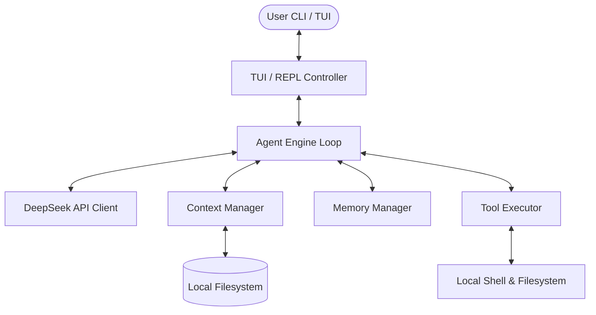

# agent-rust

An interactive, terminal-based AI software engineering agent written in Rust and optimized exclusively for the DeepSeek LLM. `agent-rust` provides a powerful console workspace that inspects your repository, writes and edits files, and executes shell commands with built-in safety controls.

---

## Features

- **Dual Workspace Interfaces**:
  - **Interactive REPL Mode (Default)**: A robust command shell using `rustyline` with persistent input history, slash commands, real-time response streaming, and interactive approval prompts.
  - **TUI Dashboard Mode**: A full-screen `ratatui` workspace featuring split panels for chat history, active file context trackers, system activity logs, and token budgets.
- **Native Project Context & Memory**:
  - **Context Manager**: Tracks target files added to context and automatically applies sliding history truncation to stay within LLM token constraints.
  - **Memory Store**: Persists learned development facts and project-specific guidelines in `~/.config/agent-rust/memory.json` across sessions.
- **Secure Native Tools**:
  - `view_file`: Paginated file reader with formatted line numbers.
  - `write_file`: Atomic file writer that creates directories and retains a `.bak` backup copy.
  - `patch_file`: Exact text block search-and-replace editor that guards against incorrect overrides.
  - `list_directory`: Sorted workspace explorer showing files, sizes, and folders.
  - `grep_search`: Recursive regex text query scanner that bypasses ignored paths like `.git` and `target`.
  - `run_command`: Subprocess shell command runner.
- **Zero-Dependency Safety**: No external MCP configurations are needed. All tools are implemented natively in Rust. High-risk actions like running shell scripts or overwriting files prompt for manual approval `[y/N]`.

---

## Source Code Structure

The project is structured modularly with clear boundaries between the API, state management, tool runtime, and terminal interfaces:

```text
src/
├── main.rs           # Application entry point; initializes engine and routes to REPL or TUI
├── config.rs         # Configuration loader; parses CLI arguments and loads DEEPSEEK_API_KEY
├── deepseek/         # DeepSeek API Integration
│   ├── mod.rs        # Exposes deepseek client and schemas
│   ├── client.rs     # Async HTTP client with Server-Sent Events (SSE) stream decoding
│   └── types.rs      # Serialization schemas for requests, responses, choices, and tool calls
├── context/          # Prompt Context Management
│   ├── mod.rs        # Exposes ContextManager
│   └── manager.rs    # Tracks active files, formats XML injection, and estimates tokens
├── memory/           # Persistent Agent Memory
│   ├── mod.rs        # Exposes MemoryManager
│   └── manager.rs    # Manages ~/.config/agent-rust/memory.json to store learned facts and logs
├── tools/            # Local Tool Execution Engine
│   ├── mod.rs        # Defines the dyn-compatible Tool trait returning Pin Box Future
│   ├── file_tools.rs # Implements view_file, write_file, patch_file, list_directory, grep_search
│   └── cmd_tool.rs   # Implements run_command with real-time stdout/stderr buffer streaming
└── ui/               # Terminal User Interfaces
    ├── mod.rs        # Exposes REPL and TUI runners
    ├── repl.rs       # interactive rustyline REPL with slash commands (/add, /drop, /memory)
    └── tui.rs        # Multi-pane split-screen Ratatui terminal dashboard
```

---

## Installation & Compiling

### Prerequisites
- Install the Rust toolchain: [rustup.rs](https://rustup.rs/)
- Obtain a DeepSeek API key: [platform.deepseek.com](https://platform.deepseek.com/)

### Configure your API Key
You can load your API key using **one** of the following methods:

1. **Environment Variable** (Recommended):
   ```bash
   export DEEPSEEK_API_KEY="your-deepseek-api-key"
   ```

2. **Local Configuration File**:
   Create a configuration key file at `~/.config/agent-rust/key`:
   ```bash
   mkdir -p ~/.config/agent-rust
   echo "your-deepseek-api-key" > ~/.config/agent-rust/key
   ```

### Compile
Clone the repository and build the binary in release mode:
```bash
cargo build --release
```
The compiled executable will be located at `target/release/agent-rust`.

---

## Quick Start

Start the agent session in your target directory:

```bash
# Run in standard REPL mode (default)
cargo run

# Run in split-screen TUI Dashboard mode
cargo run -- --tui

# Specify a custom model and token count
cargo run -- --model deepseek-chat --max-tokens 2048
```

### Command Line Arguments
```text
Usage: agent-rust [OPTIONS]

Options:
  -t, --tui                  Use Ratatui TUI interactive dashboard interface (default is line-based REPL)
  -m, --model <MODEL>        Specify the DeepSeek model to use [default: deepseek-chat]
  -m, --max-tokens <TOKENS>  Maximum completion tokens [default: 4096]
  -b, --base-url <BASE_URL>  Custom DeepSeek API Base URL
  -h, --help                 Print help
  -V, --version              Print version
```

### Interactive REPL Slash Commands
Inside the REPL, utilize standard slash commands to manage your workspace session:
- `/add <file_path>`: Loads target file contents into active LLM context.
- `/drop <file_path>`: Removes file from active LLM context.
- `/clear`: Flushes conversation history threads to free up tokens.
- `/memory`: Displays learned facts, project definitions, and developer preferences.
- `/exit`: Safely terminates the interactive session.

---

## System Design & Architecture



Please refer to the technical documents in the workspace for more details:
- [System Design Specification](design.md)
- [Implementation Task Roadmap](task.md)

---

## License
Licensed under the MIT License.
