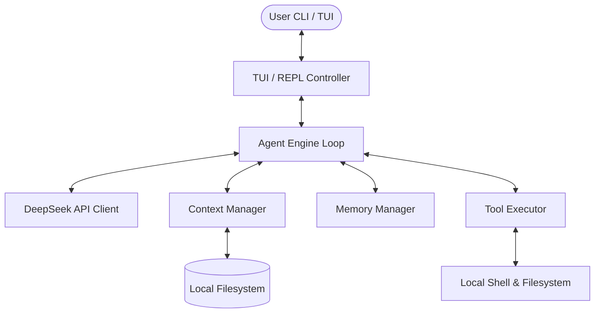

# System Design: Rust Code Agent (`agent-rust`)

This document outlines the architecture, design decisions, and system specifications for `agent-rust`, an interactive Rust-based terminal code agent modeled after modern agentic code assistants.

---

## 1. Architecture Overview

`agent-rust` is designed as a single-agent system that runs locally on the user's machine, communicating with the DeepSeek API for LLM reasoning and code generation. The architecture is modular, split into clean layers with well-defined boundaries:



### Key Modules:
1. **CLI / UI Module**: Implements a highly responsive terminal interface. Supports a dual mode:
   - **Interactive REPL**: A styled command line (like Claude Code) with markdown rendering, inline command execution, and colored logging.
   - **TUI Dashboard**: A full-screen `ratatui` terminal interface split into chat, file context, and tool logging panels.
2. **Agent Engine (Loop)**: The orchestrator that processes user input, constructs the LLM prompt, manages agent turns, parses tool requests, executes tools, returns results, and manages token budgets.
3. **DeepSeek API Client**: A lightweight async HTTP client using `reqwest` tailored specifically to the DeepSeek API, supporting tool-calling and chat completions.
4. **Context Manager**: Tracks files currently loaded into context, measures token usage, and automatically manages sliding context windows.
5. **Memory Manager**: Manages short-term (in-session) and long-term (cross-session) memory, stored locally in `~/.config/agent-rust/memory.json`.
6. **Tool Executor**: Implements secure local tools (file reads, writes, searches, shell execution) with strict user confirmation prompts.

---

## 2. Component Specifications

### 2.1. Agent Engine & Control Loop
The core control loop executes in a tokio task, processing input through an asynchronous state machine:

1. **Get User Input**: Receive raw text or commands (e.g., `/add`, `/clear`, `/exit`) from the interface.
2. **Build Prompt**: Assemble the system prompt, long-term memory snippets, active file contexts, and active chat history.
3. **LLM Inquiry**: Send the payload to DeepSeek with tool definitions.
4. **Response Evaluation**:
   - If the LLM generates a text response, render it to the user.
   - If the LLM requests one or more tool calls, pause, request user confirmation (for high-risk tools), execute the tools, add the tool outputs to the chat history, and automatically call the LLM again.
5. **Session Persistence**: Update memory and logs.

### 2.2. DeepSeek Client
DeepSeek's API is OpenAI-compatible but optimized for chat and code. We will implement:
- **API URL**: `https://api.deepseek.com/v1/chat/completions`
- **Model**: `deepseek-chat` (or `deepseek-coder` if available)
- **Features**: Streamed responses, JSON mode, and Native Function Calling (tool calls).

```rust
pub struct Message {
    pub role: Role,
    pub content: Option<String>,
    pub tool_calls: Option<Vec<ToolCall>>,
}

pub struct ToolCall {
    pub id: String,
    pub r#type: String,
    pub function: FunctionCall,
}
```

### 2.3. Context Manager
Context size is a premium resource. The context manager maintains:
- **Active File List**: A set of files the user has loaded using `/add` or the agent has self-added.
- **Dynamic Context Injection**: Appends the contents of active files into the system prompt prefix dynamically so the LLM is always aware of the target code.
- **Token Estimator**: A fast local estimator (using a char-based heuristic or `bpe` encoder) to track tokens.
- **Sliding History**: Truncates intermediate tool responses and older chat history if the total payload exceeds 64K tokens (retaining system prompt, memory, active files, and the last 3-5 turns).

### 2.4. Memory Manager
Memory is stored in a clean JSON format at `~/.config/agent-rust/memory.json`.
- **Short-Term Memory**: Session-specific variables, temporary scratchpad, and tool outputs.
- **Long-Term Memory**:
  - **Codebase Indexing**: Basic metadata about the project (main languages, directory structure).
  - **Learned Facts**: Key decisions or instructions the user has given (e.g., "always use async/await for db calls").
  - **Command History**: Past successfully run commands and user preferences.

```json
{
  "learned_facts": [
    "Project uses Actix-web for API services",
    "Database connection string is stored in environment variables"
  ],
  "preferences": {
    "default_model": "deepseek-chat",
    "theme": "dark"
  }
}
```

### 2.5. Tool Executor
Tools are native Rust functions declared to the LLM via JSON schema.

| Tool Name | Parameters | Purpose | Risk |
|---|---|---|---|
| `view_file` | `path`, `start_line`, `end_line` | Reads file content within optional line range | Low |
| `write_file` | `path`, `content` | Writes entire file | Medium (Auto-backup first) |
| `patch_file` | `path`, `target`, `replacement` | Replaces a specific block of text in a file | Medium |
| `list_directory`| `path` | Lists files in a directory | Low |
| `grep_search` | `query`, `path` | Searches for text across the codebase | Low |
| `run_command` | `command` | Runs shell commands (e.g., cargo test, git status) | High (Requires explicit UI confirmation) |

*Safety Feature*: Any execution of `run_command` and destructive edits require a interactive confirmation `[y/N]` from the user.

---

## 3. UI/UX & Interactive Console Design

The user interface supports two layouts, configurable via command-line flags (e.g., `agent-rust --tui`):

### Mode A: Interactive REPL (Default)
A rich console inspired by standard shells:
- Input prefixed with `agent-rust > ` with auto-completion for slash commands (`/add`, `/drop`, `/clear`, `/memory`, `/exit`).
- Streaming markdown answers rendered using a colorized terminal standard.
- Interactive prompts for tool confirmation with colored warning bars.
- Live progress indicator (spinner) for active LLM calls and tool executions.

### Mode B: Full-screen TUI
A multi-pane `ratatui` interface:
```
+------------------------------------------+-----------------------+
|  agent-rust -- Project Agent             | Context Files         |
+------------------------------------------+                       |
|  Agent: I have modified src/main.rs.     | * src/main.rs (1.2K)  |
|  Would you like me to run tests?         | * src/db.rs (3.4K)    |
|                                          |                       |
|  [Tool execution queued: cargo test]     |                       |
|  [y/N] Approve?                          +-----------------------+
|                                          | System Log / Terminal |
|                                          | > Executed cargo check|
|                                          | > Found 0 errors.     |
+------------------------------------------+-----------------------+
|  User >                                                          |
+------------------------------------------------------------------+
```

---

## 4. Design Decisions & Trade-Offs

1. **DeepSeek Only**: Minimizes codebase bloat by eliminating multiple multi-LLM SDK layers. Native API integration allows highly optimized token compression and precise temperature control.
2. **Single-Agent System**: Avoids complex multi-agent handshakes and message passing queues, maximizing speed and local execution performance.
3. **No MCP Required**: Local tools are implemented directly in Rust, reducing setup latency, simplifying distribution, and making installation zero-dependency except for the `cargo` toolchain.
4. **Safety Defaults**: Destructive commands require manual user confirmation. A backup file is generated when files are modified (`.bak`), which is automatically cleaned up on success.
